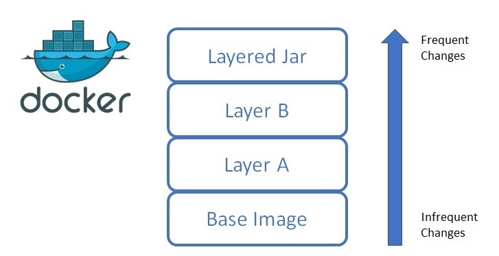

## Table of Contents

* [Prerequisites](#prerequisites)
* [Containerization Overview](#containerization-overview)
* [Factorial server](#factorial-server)
* [Dockerize Factorial Server](#dockerize)
* [Load Balancer](#load-balancer)
* [Map Reduce](#map-reduce)
* [Docker Compose](#docker-compose)

## Prerequisites
* Install [JDK version 17](https://www.oracle.com/java/technologies/javase/jdk17-archive-downloads.html)
* Install [Maven](https://maven.apache.org/install.html)
* Install [Docker](https://docs.docker.com/engine/install/)
* Install [Git](https://git-scm.com/book/en/v2/Getting-Started-Installing-Git)
* Clone the repo https://github.com/stejskal/docker-workshop 
```shell
git clone https://github.com/stejskal/docker-workshop.git
```

## Optional steps to speed up workshop
The following commands can be used to pre-download used docker images to save time during the workshop
```shell
docker pull nginx
docker pull maven
```

## Workshop goals
1. Gain basic understanding of containers and docker
1. Gain hands-on experience with basic docker commands
1. See simplified examples of how docker can help solve big data problems

## Containerization Overview
Conceptually a containerized service is a portable package of everything needed to run a single application. The most
important aspect of this packaging is that the entire filesystem needed to execute the application is included in the
definition of the containerized service.  This package can then be executed on any system that can run the container
engine.

This containerization concept can be thought of as somewhat analogous to how the JVM executes a jar.  The JVM is written
specifically for the OS its running on, and it knows how to translate the byte code in the jar into commands the OS can
execute.  


You can see in the above example that the filesystem is independent of the jar and thus the system that runs the jar
must have the proper environment setup to support the execution of the code in the jar.  This is where containerization
can increase the level of portability.

Much as a jar is 
executable by any JVM, a container can be executed by any instance of its engine running on any hardware or OS.
 The big difference is that a container encapsulates the entire required environment like JVM, dependent jars and
even OS specific binaries.


In the above example, the filesystem is included in the image (terminology below) and each container gets its own copy
of that filesystem complete with the entire environment necessary to support the execution of the code in the jar.

[See a much better overview here](https://medium.com/geekculture/introduction-to-containers-basics-of-containerization-bb60503df931)

### [Docker](https://docs.docker.com/get-started/overview/)

Docker is a popular containerization solution and will be the system we explore in this workshop.

#### Minimum Terminology
1. engine - Known as the docker daemon, this runs continuously on a server (or your machine in this case) which handles
 running containers and fulfilling client requests.
2. client - the CLI used to invoke commands on the engine.
3. Image - A read-only template with instructions for creating a Docker container. An image is composed of multiple layers.
4. Container - A container is a runnable instance of an image. You can create, start, stop, move, or delete a container.
5. Dockerfile - A text file with a sequence of steps telling docker how to create an image.
6. layer - The filesystem change which was the result of a single Dockerfile step execution.  Each layer describes
 the change applied to the layer below it.
7. Host - the system on which the docker engine is running.



#### [Docker Hub](https://hub.docker.com/)
Like maven central which serves freely available jars for use in dependencies, docker has a default repo that serves
freely available images.  These images can be used to start containers or used as a base image for a new image in 
a Dockerfile.

#### Creating a container from an existing image
```shell
docker run -p 80:80 nginx
```

#### [Container Networking](https://docs.docker.com/config/containers/container-networking/)
the `-p 80:80` portion of the above command indicates port mapping.  Each container has its own ports to which it can
listen on.  Port mappings tells the docker image to bind to a specific host port and forward all requests on that port
to a specific port on the container. the first port in the port mapping is the host port and the second is the container
port.  So in the command above we are telling the engine to forward requests to the host system that come in on port 80
to the container on its internal port 80.  

We bind to any available port on the host
```shell
docker run -p 81:80 nginx
```
In this command we are telling the engine to forward requests to the host system that come in on port 81 to the container 
on its internal port 80.

## Factorial Server
### Goal of the exercise
package and run the provided factorial server project on your local system

### High level steps
1. package the service
1. run the service
1. use a browser to hit the local service

### The Factorial Server
A simple web server with no dependencies other than the JVM.  Once started it will listen on `localhost:8080\factorial\{int}`
and will calculate the factorial of any number < Integer.MAX_VALUE and return the value.

Factorial was chosen because it is fast for small numbers but quickly becomes very cpu intensive and slow with larger numbers. 
This will allow us to simulate slow requests in later exercises.

#### Quick factorial review
In mathematics a factorial of an integer is all non-zero integers that are equal or less than the integer multiplied together.   
Represented as an integer followed by an exclamation point.

examples:   
5! = 1\*2\*3\*4\*5   
10! = 1\*2\*3\*4\*5\*6\*7\*8\*9\*10   

### Starting the server directly
The below commands are executed from the subdirectory factorial-sever
```shell
mvn package
```

```shell
java -jar target/factorial-server-1.0-SNAPSHOT.jar
```

## Dockerize
### Goal of the exercise 

Create an image that contains our jar file and will start our factorial-server when a container is created from the image.

### High level steps
1. Create the Dockerfile in the subdirectory factorial-server
1. find appropriate base image to modify
1. inject our source files into the image
1. create our jar file
1. set up the default execution command

## Load Balancer
### Problem
Our factorial server can only service a single factorial request at a time.  Any subsequent request must wait for the first
to finish.

### Goal of the exercise
Allow multiple instances of the factorial service to be running simultaneously and front those servers with a load balancer.


### High level steps
1. Get 3 instances of the factorial service running
2. Find a load balancer
3. Configure the load balancer
3. start the load balancer 

## Map Reduce
### Problem
Our factorial server takes a really long time for a single request of a large input integer.
### Goal of the exercise
Decompose the work into smaller units and have multiple services work on independent pieces of the work in parallel.

### High level steps
1. Understand the basics of Map-reduce
2. containerize the supplied map reduce server
3. kill the load balancer
4. start the map reduce server